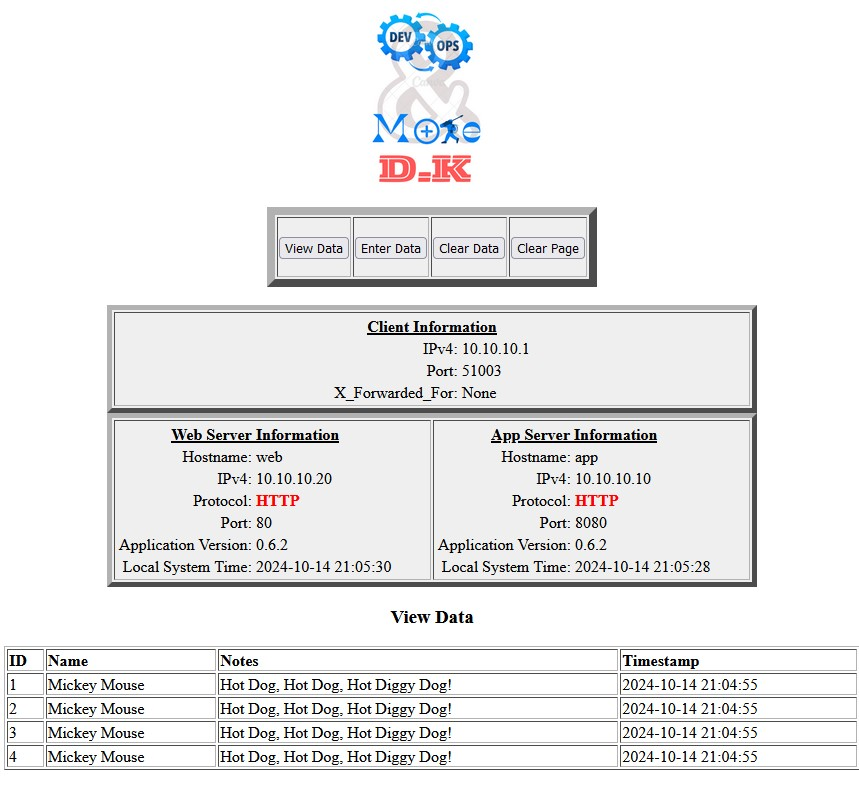
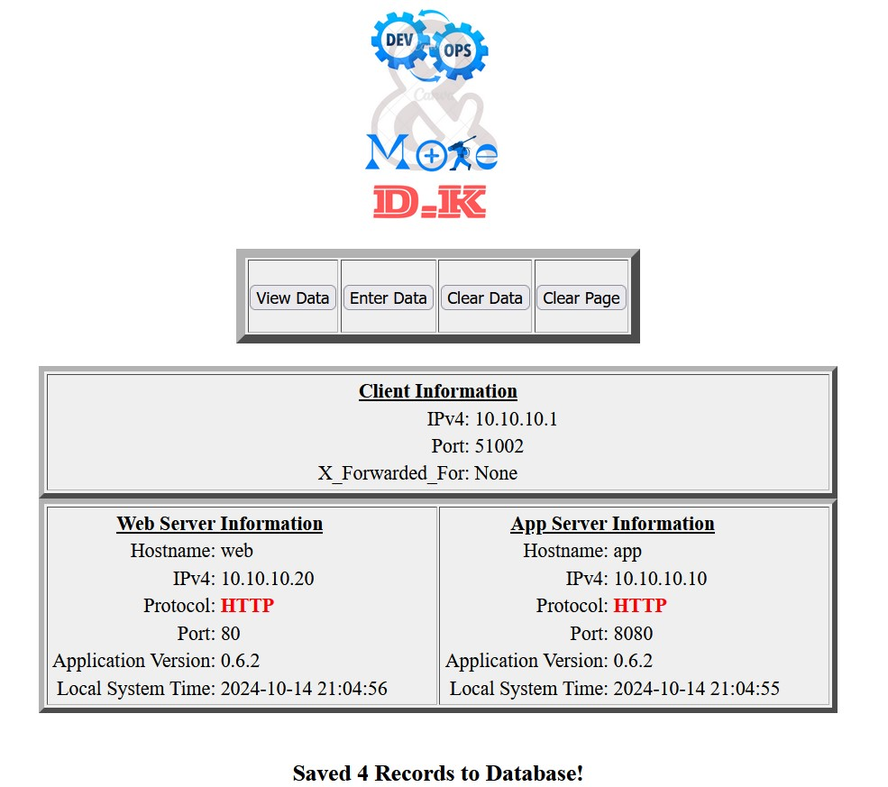
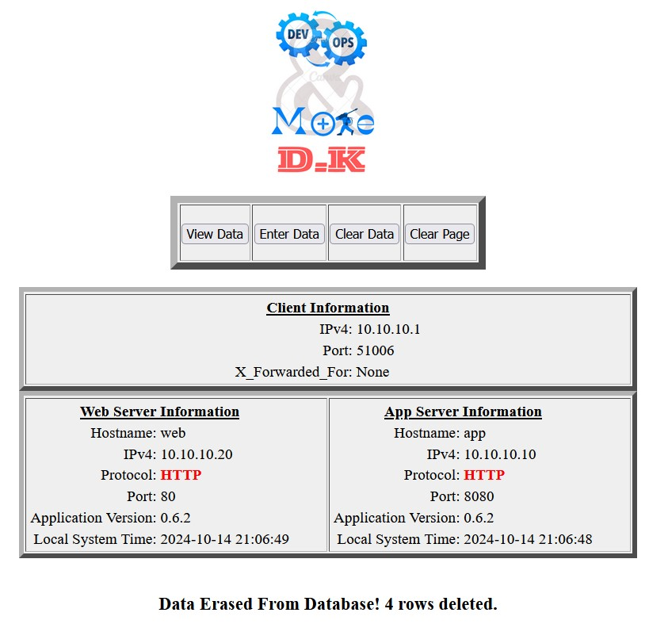

# Multi Tiered Web Application 

## Original repo:
https://github.com/brichbourg/Multi-Tier-App-Demo  
by: Brantley Richbourg (brichbourg@gmail.com)

This is a modified repo; multiple updates have been made to the Python codes. The original repo has various errors: syntax errors, command errors, etc.  
I will create a video for this repo to run the whole configurations under:
1. VMS/EC2: the YouTube video:
2. Docker/Kubernetes:

This repo comes with a Vagrant file to provision the machines under Virtual Box. To use the Vagrant file, you have to install Vagrant.

## Information
This is a Python-based web application that we developed back in the days when I was in training as a "DevOps Engineer" at m2iformation, who was hiring Ilkilab trainers to guide us through. We were more interested in CI/CD, so we didn't care about whether the code was working or not. My work here was to correct the code and update it to be compatible with Python 3 and Ubuntu 22.

This app is very simple; we have:
- A front web page hosted on Apache2 in the web server.
- An app behind the web page that is responsible for querying the data from the database. An Apache2 is also installed on this server (app server) to allow the web server to make HTTP requests to the app server.
- A MySQL server which holds our database.

On the front page, we could either: view the table in the database, insert an element, or clear the table in the database. The original repo had some issues in querying the data, HTTP requests, clearing the table, connecting to the database after clearing the table, and other issues like parsing the HTML response. Some commands in Python were deprecated (like `urllib.urlopen`) and others.

### The versions of the systems used:
* bento/ubuntu-22.04
* Python3: Python 3.10.12
* Apache/2.4.52 (Ubuntu)
* MySQL Ver 8.0.39-0ubuntu0.22.04.1 for Linux on x86_64 (Ubuntu)

## Screenshots

Here is a screenshot of the application.

### Main Menu: 

<div>
    
    
    
</div>

## Installation Instructions

### Web and App servers:
* Install Apache2 on both servers:
```bash
sudo apt update
sudo apt install apache2 -y
```
* Install Python3/Pip:
```bash
sudo apt update
sudo apt install python3 python3-pip -y
```

In order to give apache user(www-data) access to pip packages we need to creates the /var/www/.local directory with root privileges, ensuring it exists for further use. Then change the ownership of that directory to the www-data user, granting Apache permission to access it. Finally, install the pip packages (beautifulsoup4, mysql-connector-python)  for the www-data user, ensuring it is available for scripts running under Apache
```bash
sudo mkdir -p /var/www/.local
sudo chown -R www-data:www-data /var/www/.local
sudo -u www-data pip3 install --user beautifulsoup4
sudo -u www-data pip3 install --user mysql-connector-python
```
  
* Modify Apaches configs:
To point to the app directory and to allow cgi
```bash
# Change DocumentRoot to point to /var/www/html/appdemo
# This command updates the DocumentRoot in the Apache configuration
# to serve files from the new application directory.
sudo sed -i 's|DocumentRoot /var/www/html|DocumentRoot /var/www/html/appdemo|' /etc/apache2/sites-available/000-default.conf

# Remove the existing <Directory> section in 000-default.conf
# This command deletes any existing <Directory> sections for /var/www/html
# to avoid conflicts or duplication in the configuration.
sudo sed -i '/<Directory \/var\/www\/html>/,/<\/Directory>/d' /etc/apache2/sites-available/000-default.conf

# Append new <Directory> section directly after <VirtualHost *:80>
# This command inserts a new <Directory> block to allow CGI execution
# and set 'index.py' as the default file when accessing the directory.
sudo sed -i '/<VirtualHost \*:80>/a \
<Directory /var/www/html> \
    Options +ExecCGI \
    DirectoryIndex index.py \
    AddHandler cgi-script .py \
</Directory>' /etc/apache2/sites-available/000-default.conf
```
Disable the Event MPM and enable the Prefork MPM along with the CGI module in Apache. Then, restart the Apache server to apply these changes.
```bash
  sudo a2dismod mpm_event
  sudo a2enmod mpm_prefork cgi
  sudo service apache2 restart
```
* Clone the repo:
```bash
sudo apt-get install git
git clone https://github.com/devops-and-more/Multi-tier-app.git
```
* run the script dedecated to place the files inside /var/www/html/, if you have some issues with the script you can copy the files manually:
```bash
cd Multi-tier-app/
sudo bash install.sh
```
Change the owner and the permissions of the directory in order the files to be owned by apache user and allowed to be excuted by anyone
```bash
# Change permissions for the appdemo directory to 755 (read and execute for others)
sudo chmod 755 /var/www/html/appdemo
sudo chmod 755 /var/www/html/appdemo/*
# Change ownership of the appdemo directory to www-data (Apache user)
sudo chown -R www-data:www-data /var/www/html/appdemo
```


### Web server configs:
No need for configuration because apache is comes with default configs to listen on port 80 on all interfaces
### App server configs:
* Configure apache to listen on port 8080 (just to distinguish between the two) to the connections on all interfaces:

```bash
sudo sed -i 's|Listen 80|Listen 8080|' /etc/apache2/ports.conf
sudo sed -i 's|<VirtualHost \*:80>|<VirtualHost *:8080>|' /etc/apache2/sites-available/000-default.conf # note that I used \* otherwise sed will not find a match
```
* Install package to allow app servers to connect to MySQL:
```bash
pip install mysql-connector-python
```
 the `/etc/mtwa/mtwa.conf` file looks like:
```bash
# Multi-Tier-App-Demo configuration file

# Enter the name of the app server or load balancer (DNS or IP address; DNS preferred)
AppServerName = app
# Enter the name of the MySQL server (DNS or IP address; DNS preferred)
DBServerName = db
```
those two dns names are already configured inside /etc/hosts, if you use diffrent names you should change the file here to match your /etc/hosts file.
Becareful the well functioning of the app depends on this!!!


### Mysql server:
install mysql:
```bash
sudo apt-get update
sudo apt-get install mysql-server -y
```
* Download the initial SQL file:
```bash
wget "https://raw.githubusercontent.com/devops-and-more/Multi-tier-app/refs/heads/main/sql/create_db_table.sql"
```

* Now log into your MySQL server as root where your pwd should contains the downloaded file (.sql); because you need it once you are inside mysql:
```bash
sudo mysql -u root -p
# <enter your root password>
```
```bash
# after logging create the table from the file 
source /home/vagrant/create_db_table.sql;
```

Here is the SQL code being injected:
```sql
CREATE DATABASE `appdemo`;
USE `appdemo`;
CREATE TABLE `demodata` (
    `id` INTEGER NOT NULL AUTO_INCREMENT,
    `name` VARCHAR(100),
    `notes` TEXT,
    `timestamp` TIMESTAMP,
    PRIMARY KEY (`id`),
    KEY (`name`)
);

CREATE TABLE `demodata_erase_log` (
    `id` INTEGER NOT NULL AUTO_INCREMENT,
    `timestamp` TIMESTAMP,
    PRIMARY KEY (`id`),
    KEY (`timestamp`)
);
# Create a new user 'appdemo' that can connect from any host ('%') with the password 'appdemo'.
CREATE USER 'appdemo'@'%' IDENTIFIED BY 'appdemo';
# Grant all privileges on the 'appdemo' database to the user 'appdemo', allowing them to grant these privileges to other users.
GRANT ALL PRIVILEGES ON appdemo.* TO 'appdemo'@'%' WITH GRANT OPTION;
```
That user and password will be used by the app server to authenticate to mysql, if you change them here you should change the python file related to the database (viewdb, commitdb-ap ...)
* Edit `/etc/mysql/mysql.conf.d/mysqld.cnf` to allow for network connections. Use VI or NANO to edit and change `bind-address = 127.0.0.1` to `bind-address = *`. This will tell MySQL to listen for connections on port TCP:3306 on all interfaces:
```bash
sudo sed -i 's|^bind-address\s*=\s*127.0.0.1|bind-address = 0.0.0.0|g' /etc/mysql/mysql.conf.d/mysqld.cnf
# Restart mysql
sudo systemctl restart mysql
```
 To chkeck on what mysql is listening:
 ```bash
 sudo apt update
sudo apt install net-tools
sudo netstat -tulnp | grep mysql
```


HTTPS:
Openssl is already installed on ubuntu 22.


Create a directory to store the certificate and key, then generate the self-signed cert/key
```bash
sudo mkdir /etc/apache2/ssl

sudo openssl req -x509 -nodes -days 365 -newkey rsa:2048 -keyout /etc/apache2/ssl/apache.key -out /etc/apache2/ssl/apache.crt
```
You will be prompted to enter some information for the certificate, you can leave everything blank

Add to the config file of apache those https lines:

```bash
sudo bash -c 'cat <<EOL >> /etc/apache2/sites-available/000-default.conf
<VirtualHost  *:443>
    ServerAdmin webmaster@localhost
    DocumentRoot /var/www/html/appdemo

    SSLEngine on
    SSLCertificateFile /etc/apache2/ssl/apache.crt
    SSLCertificateKeyFile /etc/apache2/ssl/apache.key

    <Directory /var/www/html>
        Options +ExecCGI
        DirectoryIndex index.py
        AddHandler cgi-script .py
    </Directory>

    ErrorLog \${APACHE_LOG_DIR}/error.log
    CustomLog \${APACHE_LOG_DIR}/access.log combined
</VirtualHost>
EOL'
```


Enable the SSL module and the default configs, Restart apache

```bash

sudo a2enmod ssl
sudo a2ensite default-ssl
sudo systemctl restart apache2
```
Further Security requirement:
We can add some security precautions such: app server will only accept http requests from web server, mysql server can only communicate with app server, in local we can realize that with some filtering tools like firewalld, iptables, in the cloud we could use security group and network acl in aws:
An example is giving here by firewalld:


Filetering Http requests on app srv:
the app server should only accespt requests comming from web ip no one
else, therfore we install firewalld to filter the requests:
```bash
sudo apt update
sudo apt install firewalld -y
sudo systemctl enable firewalld --now 
# define the rules:
# 1- Allow HTTP traffic on port 8080 from the web ip which is 10.10.10.20
sudo firewall-cmd --permanent --add-rich-rule='rule family="ipv4" source address="10.10.10.20" port port="8080" protocol="tcp" accept'
# 2- Deny other Http requests:
sudo firewall-cmd --permanent --add-rich-rule='rule family="ipv4" port port="8080" protocol="tcp" drop'
# Reload :
sudo firewall-cmd --reload
sudo systemctl stop firewalld
sudo systemctl enable firewalld
```